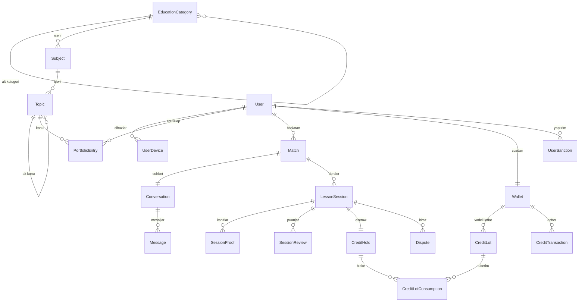

# AŞAMA 1 — Veritabanı Şeması ve Proje Mimarisi

> Akran Eğitimi Platformu · .NET 8 + PostgreSQL + Redis + React
> Sıfır Toplamlı Kredi Ekonomisi (zaman/yetenek takası)

## 1. Mimari Yaklaşım: Pragmatik Modüler Monolit

Tek deploy edilebilir uygulama, **tek PostgreSQL veritabanı**, ama modül sınırları iki
mekanizmayla korunuyor:

1. **PostgreSQL şema ayrımı** — her modülün tabloları kendi şemasında yaşar:
   `catalog`, `identity`, `matchmaking`, `comms`, `scheduling`, `economy`, `moderation`.
   İleride bir modül mikroservise ayrılırsa kendi şeması kendi veritabanına taşınır.
2. **Modüller arası navigation property yasağı** — modüller birbirine yalnızca `Guid` FK ile
   referans verir (ör. `LessonSession.TutorUserId`), C# tarafında `User` navigation'ı yoktur.
   FK bütünlüğü yine de DB seviyesinde korunur (`HasOne<User>().WithMany()...`).

İki kişilik ekip için tek `DbContext` + tek migration seti bilinçli bir tercihtir:
modül başına ayrı DbContext'in getireceği cross-module transaction karmaşıklığı,
bu ölçekte maliyetine değmez. Sınırlar yukarıdaki iki kuralla korunduğu sürece
ileride bölmek mekanik bir iştir.

## 2. Klasör Yapısı

```
PeerLearn.slnx
src/
  PeerLearn.Domain/              → Saf entity'ler + enum'lar (hiçbir pakete bağımlı değil)
    Common/                      → BaseEntity
    Catalog/                     → EducationCategory, Subject, Topic
    Identity/                    → User, UserDevice
    Matchmaking/                 → PortfolioEntry, Match
    Communication/               → Conversation, Message
    Scheduling/                  → LessonSession, SessionProof, SessionReview
    Economy/                     → Wallet, CreditLot, CreditHold, CreditTransaction, CreditLotConsumption
    Moderation/                  → Dispute, HwidBan, UserSanction
  PeerLearn.Application/         → AŞAMA 2: CQRS handler'ları (Features/<Modül>/<UseCase>)
  PeerLearn.Infrastructure/
    Persistence/
      PeerLearnDbContext.cs
      Configurations/            → Modül başına IEntityTypeConfiguration dosyası
  PeerLearn.Api/                 → Composition root; AŞAMA 2'de SignalR hub'ları, JWT, controllers
tools/
  PeerLearn.SchemaCheck/         → EF modelini DB'siz kurup doğrulayan CI aracı (dotnet run)
docs/
frontend/                        → AŞAMA 3: React (Vite + Tailwind)
```

## 3. Modül Haritası



## 4. Ekonomi Tasarımı — Neden Lot Bazlı?

"Kazanılan puanın 30 gün ömrü vardır" kuralı, tek bir `Balance` kolonuyla **doğru
uygulanamaz**: hangi puanın ne zaman kazanıldığı bilinmeden hangisinin vadesinin
dolduğu bilinemez. Çözüm hava yolu mil sistemlerindeki gibi **lot muhasebesi**:

- Her kazanç ayrı bir `CreditLot` açar (`InitialAmount`, `RemainingAmount`, `ExpiresAtUtc`).
- Harcama, lotları **vadesi en yakın olandan** (FIFO) tüketir → öğrencinin puanı
  gereksiz yere yanmaz.
- Vade dolumu job'ı yalnızca `RemainingAmount > 0 AND ExpiresAtUtc < now()` lotları
  kapatır ve `Expiry` tipinde ledger kaydı yazar (filtered index bu sorgu içindir).

### Rezervasyon = Escrow (CreditHold)

Ders rezerve edilirken kredi **hold**'a alınır:

1. Lotlardan FIFO düşülür (`CreditLotConsumption` ile hangi lottan ne düşüldüğü izlenir).
2. Cüzdanda `Available → Locked` taşınır.

Bu tasarımın iki kritik sonucu var:

- **Çifte harcama imkânsız**: bloke edilen kredi başka derse harcanamaz
  (`CK_Wallets_AvailableBalance >= 0` son savunma hattı).
- **Vade oyunu imkânsız**: bloke kredi lotlardan zaten düşüldüğü için vade job'ı ona
  dokunamaz; ama iptal edilirse aynı lotlara iade edilir ve vadesi geçmişse job doğal
  olarak yakar. Sahte rezervasyonla puan ömrü uzatılamaz.

İade (Release) mevcut tüketim kayıtlarını **değiştirmez**: aynı (hold, lot) çifti için
`IsReversal = true` yeni satır yazılır. `(CreditHoldId, CreditLotId, IsReversal)` unique
index'i sayesinde çifte iade (crash/retry senaryosu) DB seviyesinde imkânsızdır ve
defter append-only kalır.

### Ders Onayı = Capture

Öğrenci onay verdiğinde tek atomik DB transaction içinde:

1. `CreditHold.Status = Captured`, `Wallet.Locked -= N` (öğrenci)
2. Öğrenciye `LessonSpending (−N)`, eğitmene `LessonEarning (+N)` ledger kaydı —
   ikisi **aynı `CorrelationId`** ile bağlanır, toplamları daima 0.
3. Eğitmende `ExpiresAtUtc = now + 30 gün` olan yeni `CreditLot` açılır.
4. `LessonSession.Status = Completed`.

### İtiraz Semantiği: Her Zaman Capture Öncesi

İtiraz, ders `AwaitingApproval` aşamasındayken açılır — yani kredi henüz **hold'dadır**,
transfer olmamıştır ("itirazda transfer donar"). Bu yüzden:

- Öğrenci lehine çözüm = hold **Release** (kredi öğrencinin lotlarına geri döner).
- Eğitmen lehine çözüm = hold **Capture** (normal transfer çalışır).
- Şemada bilinçli olarak `DisputeRefund` diye bir lot kaynağı/hareket tipi **yoktur**:
  hold iadesiyle birlikte ayrı bir refund kaydı, yoktan kredi üretir ve
  `SUM(Amount) GROUP BY CorrelationId = 0` mutabakatını bozardı.

### Değişmezler (Invariants) — mutabakat sorguları

| Değişmez | Kontrol |
|---|---|
| Cüzdan tutarlılığı | `Wallet.AvailableBalance == SUM(CreditLots.RemainingAmount)` |
| Escrow tutarlılığı | `Wallet.LockedBalance == SUM(CreditHolds.Amount WHERE Active)` |
| Sıfır toplam | `SUM(Amount) GROUP BY CorrelationId == 0` (transfer bacakları) |
| Küresel arz | `SUM(tüm bakiyeler) == SUM(WelcomeBonus) − SUM(Expiry)` |

## 5. Güvenlik Katmanları (şemadaki karşılıkları)

| Tehdit | Şema önlemi |
|---|---|
| Negatif bakiye / yoktan kredi | `CK_Wallets_*` check constraint'leri + append-only ledger |
| Çifte onay (double capture) | `CreditHolds.SessionId` unique + `LessonSession.Version` (xmin) + `CreditTransactions(RelatedSessionId, Type)` partial unique + `CreditLots.SourceSessionId` partial unique |
| Çifte hold iadesi (retry) | `CreditLotConsumptions(CreditHoldId, CreditLotId, IsReversal)` unique |
| Eşzamanlı harcama yarışı | `Wallet.Version` (xmin) optimistic concurrency + AŞAMA 2'de Redis lock |
| Mutabakattan kaçan bacak | `CK_CreditTransactions_TransferLegs`: transfer bacaklarında `CorrelationId`/`CounterpartyUserId`/`RelatedSessionId` zorunlu |
| Sahte ekran görüntüsü | `SessionProofs.Sha256Hash` index'i → aynı görselin tekrar kullanımı tespit |
| Hoş geldin kredisi farmi | `User.WelcomeCreditGrantedAtUtc` guard + **cüzdan başına tek WelcomeBonus lotu** (partial unique) + `HwidBans` cihaz kontrolü |
| Ban kaçağı (yeni hesap) | `UserDevices.HwidHash` ↔ `HwidBans.HwidHash` (aktif banlarda unique) eşleşmesi |
| Aynı kişiye istek spam'i | `Matches` üzerinde Pending-filtreli partial unique index |

## 6. Bilinçli Tercihler / Notlar

- **Enum'lar DB'de string** (`HasConversion<string>`): `pg_enum` migration zorluğuna
  girmeden okunabilir veri; partial index filter'ları (`"Status" = 'Pending'`) bu
  literal'lerle çalışır. Enum'a üye eklemek migration gerektirmez.
- **Soft delete yok, `Restrict` var**: finansal izlenebilirlik için hiçbir tablo cascade
  silinmez. Kullanıcı silme = `Status = Banned/Suspended` + KVKK gereği PII anonimleştirme
  (ileriki aşama).
- **Çakışan rezervasyon (double booking)**: MVP'de uygulama katmanı kontrolü; ileride
  PostgreSQL `EXCLUDE USING gist (tstzrange(...))` constraint'i raw migration ile eklenebilir.
- **`timestamptz` her yerde**: tüm `DateTime` alanları UTC; isimlendirme `...Utc` son ekiyle.
- **Partial index ekip kuralı**: `HasFilter(...)` taşıyan bir index, sorgunun WHERE'i o
  koşulu birebir içermedikçe kullanılmaz. Parent-FK bazlı "tam geçmiş" sorgusu olan
  tablolarda (`CreditLots.WalletId` gibi) ayrıca düz FK index'i tanımlıdır; yenisini
  eklerken aynı kurala dikkat edin (EF, FK ile başlayan declared index görünce otomatik
  FK index'i üretmez — filter'lı olsa bile).

## 7. Migration Komutları (ilk kurulum)

```bash
dotnet tool install --global dotnet-ef
dotnet ef migrations add InitialCreate --project src/PeerLearn.Infrastructure --startup-project src/PeerLearn.Api
dotnet ef database update --project src/PeerLearn.Infrastructure --startup-project src/PeerLearn.Api
```

Şema değişikliği sonrası hızlı doğrulama (DB gerekmez):

```bash
dotnet run --project tools/PeerLearn.SchemaCheck
```

## 8. AŞAMA 2 Önizlemesi

1. **Time-Lock + Capture servisi** — `IsolationLevel.ReadCommitted` transaction,
   `Wallet.Version` çakışmasında retry, Redis distributed lock (`lock:wallet:{userId}`).
2. **SignalR ChatHub** — `Conversation.Id` bazlı gruplar, Redis backplane.
3. **Background job'lar** (Hangfire): lot vade dolumu, `Booked → Expired` süpürme,
   48 saatte otomatik onay (öğrenci onaya yanıt vermezse).
4. **Eşleştirme sorgusu** — `PortfolioEntries` üzerinde çapraz self-join LINQ.
